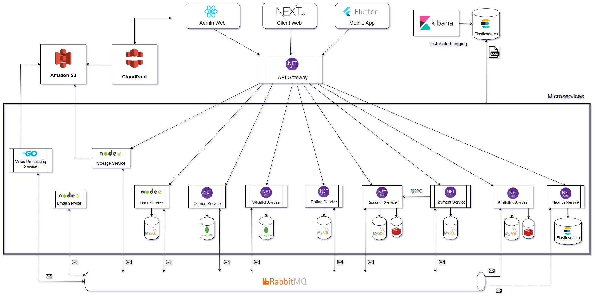
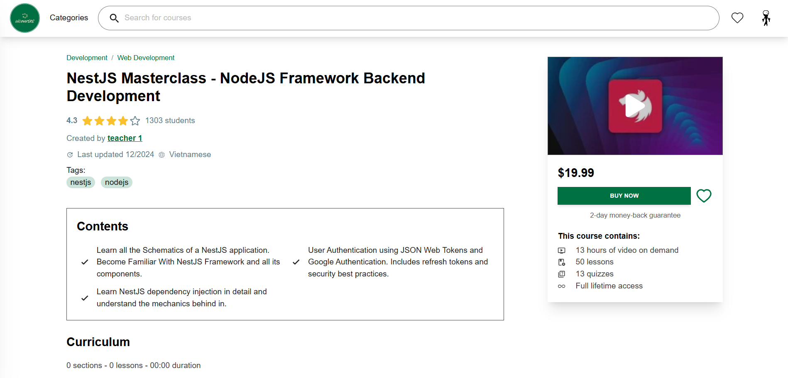

# Vicourses | E-Learning Platform

This project is an online learning platform that allows instructors to upload courses, and students can access and watch them. The project uses Microservices Architecture to build the backend, Nextjs for the client web, React for the admin web and Flutter for the mobile app.


## Architecture




## Technologies Overview
- Database: MySQL, MongoDB
- ASP.NET Core 8
- Entity Framework Core
- Ocelot Api Gateway
- NodeJS
- ExpressJS
- Golang
- Redis
- Elasticsearch
- RabbitMQ
- FFmpeg for video processing
- Data replication across services for higher availability, scalability, performance
- Distributed logging using ElasticSearch, Filebeat and Kibana
- Docker
- React
- NextJS 14
- Flutter
## Features
- Login, register, confirm email, reset password, google login.
- User profile management.
- Browse courses.
- User wishlist.
- Course ratings.
- Learning activities: watch videos, take quizzes, comment.
- Instructor dashboard to manage courses, view and respond ratings, view instructor performance (revenue, enrollment, refund metrics).
- Course curriculum management: Manage sections, lessons. Upload videos, create quizzes.
- Coupon management for instructor.
- Admin dashboard to manage users, courses, categories.
- Asynchronous processing to generate HLS streaming segments with different resolutions for uploaded videos
- Send email
- Online payment using Paypal Gateway
- Login and link Paypal account
- View purchase history, refund
- ...
## Folder Structure
Here's an overview of folders and their purposes in the project:
```
.
├── /backend                         # Backend codebase
└────────────/ApiGateway             # ApiGateway for microservices
└────────────/services               # All microservices codebase
├── /deployments                     # Scripts for Docker deployment and services configuration
├── /frontend                        # Frontend codebase
└────────────/vicourses_client_web   # Client web codebase
└────────────/vicourses_admin_web    # Admin web codebase
└────────────/vicourses_mobile_app   # Mobile app codebase

```
## Screenshots





[MORE SCREENSHOTS](./images/screenshots.md)
## Running with Docker
To run the backend and its necessary infrastructure, navigate to the **deployments** directory, make sure that you have Docker, Docker Compose and OpenSSL installed on your machine.

Optional, there are some environment variables you may want to set if you want to use some features below:
 - Google login: provide google clientid to `services/user_service/.env` file
 - Pay with paypal or link paypal account: provide paypal clientid and secret to `services/user_service/.env` and `services/payment_service/.env` file
 - Send email: provide SMTP configuration to `services/email_service/.env` file
  - Upload, get files: provide AWS S3, Cloudfront configuration to `services/storage_service/.env` file and Cloudfront key pair to `services/storage_service/cf-keypair/` directory
  - Video processing: provide AWS S3 and Rclone configuration to `services/video_processing_service/.env` file

At the **deployments** directory, run the following command:

**Windows**
   ```shell
   .\start.bat
   ```

**Linux**
   ```shell
   ./start.sh
   ```

The command will launch 20 containers, including microservices and infrastructure.

After all the containers is running, you should able to browse the different urls by visiting:
   ```shell
   Swagger: http://localhost:8000/swagger
   Healthchecks: http://localhost:8000/hc-ui
   Kibana: http://localhost:5601 (user: elastic - pass:123456)
   RabbitMQ UI: http://localhost:15672 (user: vicourses - pass:123456)
   ```
Username and password for both MySQL and MongoDB are root:123456.

To run the frontend, navigate to the frontend project you want to run in the **frontend/** directory and follow the instructions to run it.
