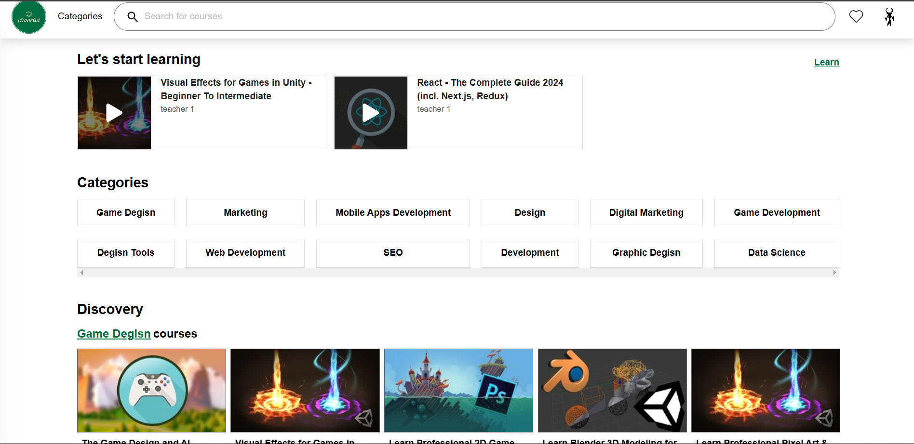
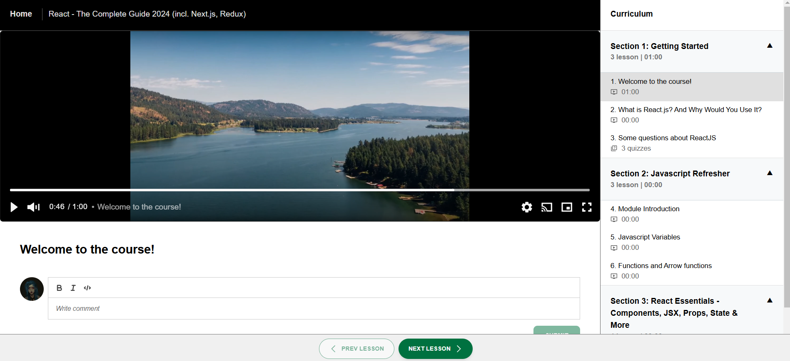

# Vicourses | E-Learning Platform

This project is an online learning platform that allows instructors to upload courses, and students can access and watch them. The project uses Microservices Architecture to build the backend, Nextjs for the client web, React for the admin web and Flutter for the mobile app.


## Architecture


## Technologies Overview
- Database: MySQL, MongoDB
- Dotnet 8
- ASP.NET Core 8
- Entity Framework Core
- Ocelot Api Gateway
- Nodejs
- Expressjs
- Golang
- Redis
- Elasticsearch
- RabbitMQ
- FFmpeg for video processing
- Data replication across services for higher availability, scalability, performance
- Distributed logging using ElasticSearch, Filebeat and Kibana
- Docker
- Nextjs 14
## Features
- User registration, login, email confirmation, password reset, Google login and user profile management
- Instructor dashboard to manage courses (courses, sections, lessons, coupons, ...), view and respond ratings, view instructor performance (revenue, enrollment, refund)
- Admin dashboard to manage users, courses, categories 
- Asynchronous processing to generate HLS streaming segments with different resolutions for uploaded videos
- Search and discovery of courses
- Lesson commenting
- Course rating
- User wishlist
- Send email
- Image, video upload
- Online payment using Paypal Gateway
- Login and link Paypal account for the Payouts feature
- Refund
- ...
## Folder Structure
Here's an overview of folders and their purposes in the project:
```
.
├── /backend                         # Backend codebase
└────────────/ApiGateway             # ApiGateway for microservices
└────────────/services               # All microservices codebase
├── /deployments                     # Scripts for Docker deployment and services configuration
├── /frontend                        # Frontend codebase
└────────────/vicourses_client_web   # Client web codebase
└────────────/vicourses_admin_web    # Admin web codebase

```
## Screenshots






[MORE SCREENSHOTS](./images/screenshots.md)
## Running with Docker
To run the backend and its necessary infrastructure, make sure that you have Docker and Docker Compose installed on your machine.

**First**, navigate to the **deployments/services/user_service** directory, run commands below to generate RSA key pairs (make sure OpenSSL is installed on your machine). 
   ```shell
   openssl genrsa -out private.key -traditional 2048
   openssl rsa -pubout -in private.key -out public.key
   ```

**Optional**, there are some configuration you may want to set if you want to use some features below: (all configuration is in **deployments/services/** directory)
 - Google login: set the `GOOGLE_CLIENT_ID` and `GOOGLE_CLIENT_SECRET`  in **user_service/.env** file
 - Pay with paypal or link paypal account: provide your paypal clientid and secret to `.env` file in **user_service/** and **payment_service/**
 - Send email: provide SMTP configuration to `.env` file in **email_service/**
  - Upload files: provide S3 configuration to `.env` file in **storage_service/**
  - Video processing: provide S3 and Rclone configuration to `.env` file in **video_processing_service/**

In the **deployments** directory, run:
   ```shell
   docker-compose -p vicourses up -d
   ```
The command will launch 20 containers, including microservices and infrastructure.

After all the containers is running, you should able to browse the different urls by visiting:
   ```shell
   Swagger: http://localhost:8000/swagger
   Healthchecks: http://localhost:8000/hc-ui
   Kibana: http://localhost:5601 (user: elastic - pass:123456)
   RabbitMQ UI: http://localhost:15672 (user: vicourses - pass:123456)
   ```
Username and password for both MySQL and MongoDB are root:123456.

To run the frontend, navigate to the frontend project you want to run in the **frontend/** directory and run the `Dockerfile` or run it manually